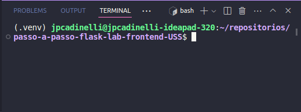
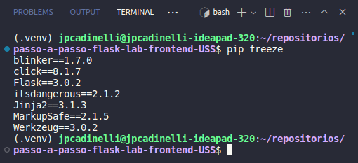
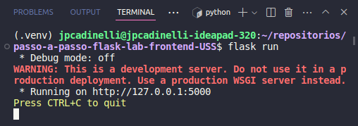

# Passo a Passo Flask

Passo a passo para intalar e rodar um projeto flask no linux, para a aula laboratório de programação frontend.

## Linux
### Passo 1: Instalar e ativar o ambiente virtual

O virtualenv é uma ferramenta em Python que permite criar ambientes virtuais isolados. Esses ambientes permitem que você instale e gerencie pacotes Python de forma independente, evitando conflitos entre diferentes projetos. Isso é útil quando você precisa trabalhar em vários projetos com diferentes requisitos de pacotes ou versões de Python. Em resumo, o virtualenv ajuda a manter a organização e a consistência no desenvolvimento de software Python.


Utilize o comando abaixo no terminal raiz do projeto

```
python3 -m virtualenv .venv
```
Após o comando rodar irá ser criada uma pasta com nome ".venv" na raiz do projeto. Portanto ".venv" é o nome do seu ambiente virtual.

Agora que já instalou o ambinte virtual, vamos ativa-lo.

No mesmo terminal, insira o seguinte comando:
```
source .venv/bin/activate
```
Olhe para o terminal e procure o nome do seu ambiente virtual entre parênteses, localizado antes da linha de comando como na foto abaixo.



### Passo 2: Instalação do Flask e dependências

Para instalar Flask e dependências, utilizamos o pip.

O pip é o sistema de gerenciamento de pacotes em Python. Ele facilita a instalação, atualização e remoção de pacotes Python, permitindo que os desenvolvedores instalem bibliotecas de terceiros e outras dependências facilmente em seus projetos.

O Flask é um framework web em Python. Com o Flask, é possível criar rapidamente aplicativos web pequenos e médios, fornecendo funcionalidades básicas para roteamento, gerenciamento de solicitações e respostas HTTP, além de suporte a extensões para funcionalidades adicionais, como autenticação e banco de dados.

Para a instalação do Flask utilize o comando abaixo na pasta raiz do porjeto com o ambiente virtual ativo.
```
pip install flask
```
Para confirmar a instalação do Flask, utilize o comando:
```
pip freeze
```
Este comando informa as bibliotecas que foram instaladas e dentre elas deve conter o Flask como na imagem.



### Passo 3: Construção do Flask app

Na pasta raiz do projeto crie um arquivo com o nome app.py com o seguinte código.

```python
from flask import Flask

app = Flask(__name__)

@app.route("/")
def index():
    return "<h1>Olá mundo!</h1>"
```

Este código é um exemplo básico de uma aplicação web usando Flask, um framework web em Python. Vou explicar linha por linha:

```python
from flask import Flask
```
- Nesta linha, estamos importando a classe `Flask` do módulo `flask`. Isso nos permite criar uma instância de um aplicativo Flask.

<br>

```python
app = Flask(__name__)
```
- Aqui, estamos criando uma instância da classe `Flask` e atribuindo-a à variável `app`. O parâmetro `__name__` é usado para determinar o nome do pacote da aplicação, que é usado pelo Flask para encontrar recursos estáticos, como modelos e arquivos CSS.

<br>

```python
@app.route("/")
```
- Este é um decorador em Python que é usado para associar uma função a uma URL específica. No caso, a função `index()` será chamada quando alguém acessar a URL raiz ("/") da aplicação.

<br>

```python
def index():
    return "<h1>Olá mundo!</h1>"
```
- Aqui, definimos a função `index()`, que retorna a string HTML `"<h1>Olá mundo!</h1>"`. Essa será a resposta que o servidor enviará para o navegador quando alguém acessar a URL raiz.

Em resumo, este código cria um aplicativo Flask simples que retorna a mensagem "Olá mundo!" quando a URL raiz é acessada no navegador.

### Passo 4: Rodar o Projeto em Flask

Após a conclusão de todos os passos antestiores, basta retornar ao terminal que está com o ambiente virtual ativo e utilizar o comando abaixo.

```
flask run
```

Se todos os passos foram feitos corretamente, deve aparacer as seguintes mensagens no terminal:



Ao segurar o control e clicar no [http://127.0.0.1:5000](http://127.0.0.1:5000) você será redirecionado para o servidor local com este projeto e o seguinte texto "Olá Mundo!"

Parabéns! Agora você completou seu primeiro projeto em Flask. Agora aconselho você a subi-lo para um repositório no github.